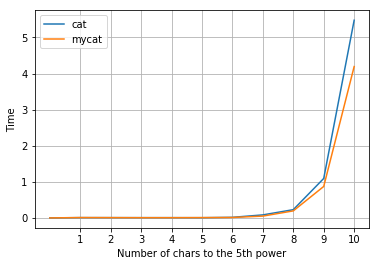

# Report for Lab 1.1


```python
import benchmark
import matplotlib.pyplot as plt
```

## Create files with 5, 25, 125... and benchmarking with cat and my cat


```python
results = benchmark.run('cat', 'mycat')
```

    Creating file with 5 chars...
    Creating file with 25 chars...
    Creating file with 125 chars...
    Creating file with 625 chars...
    Creating file with 3125 chars...
    Creating file with 15625 chars...
    Creating file with 78125 chars...
    Creating file with 390625 chars...
    Creating file with 1953125 chars...
    Creating file with 9765625 chars...


```python
cat = [0]
mycat = [0]
for a,b in results: cat.append(a); mycat.append(b);
```

## Plot the times with each program


```python
plt.plot(cat, label='cat')
plt.plot(mycat, label='mycat')
plt.legend()
plt.xlabel('Number of chars to the 5th power')
plt.ylabel('Time')
plt.xticks([1,2,3,4,5,6,7,8,9,10])
plt.grid()
```





```python

```


```python

```
